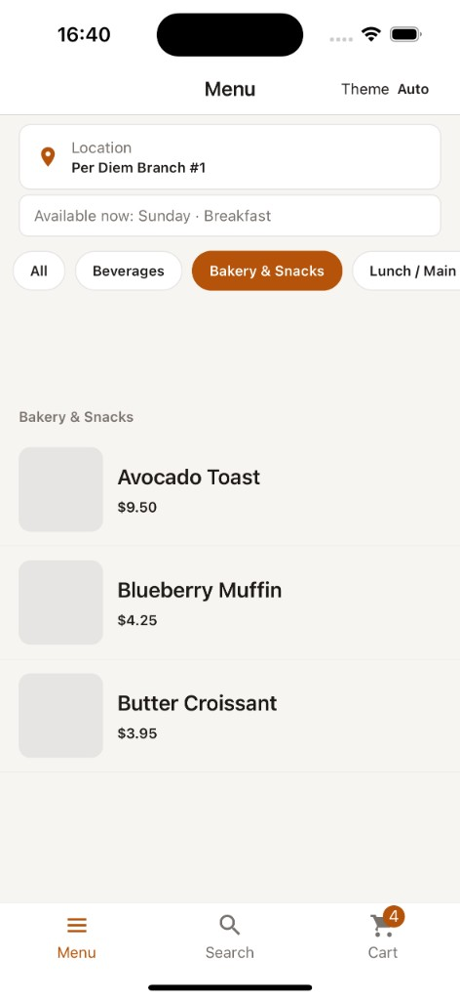
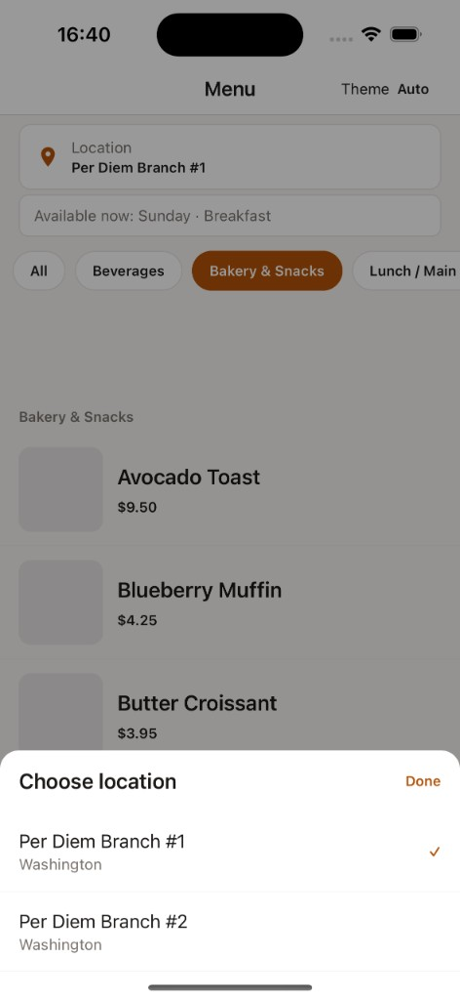
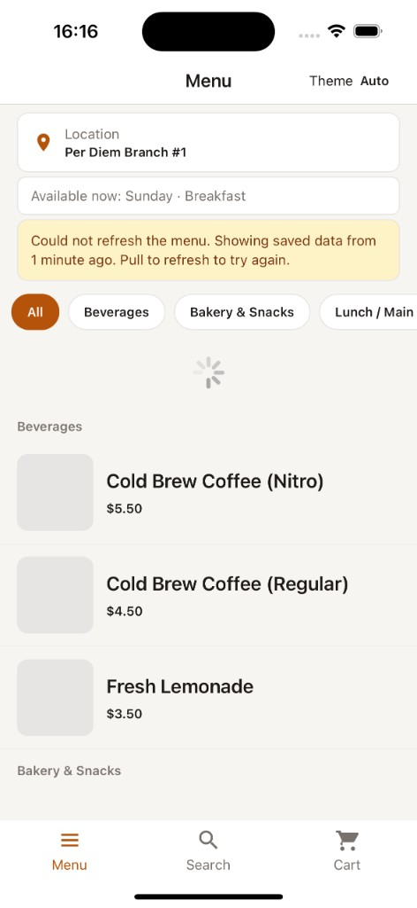
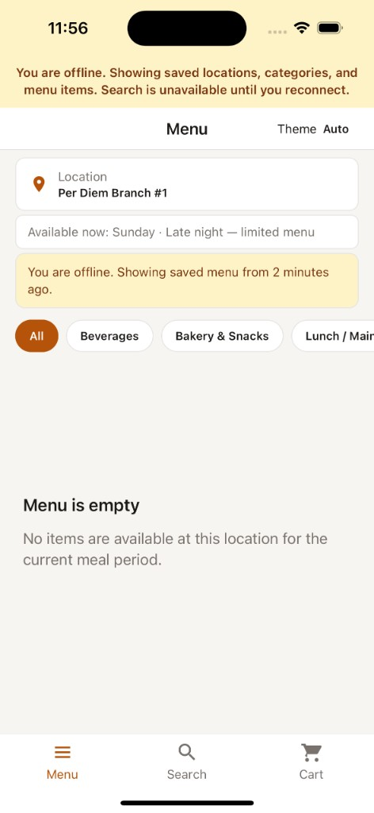
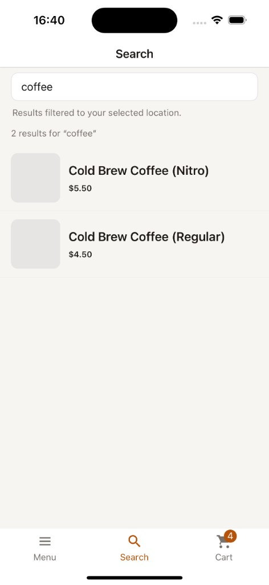
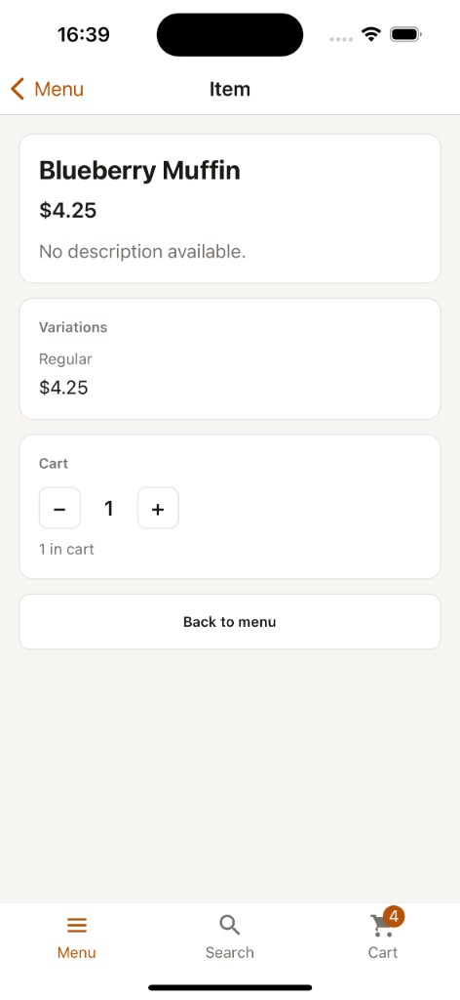
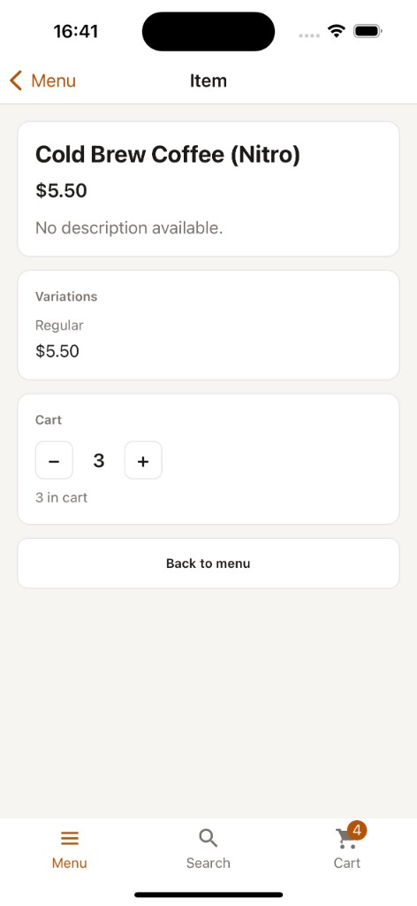
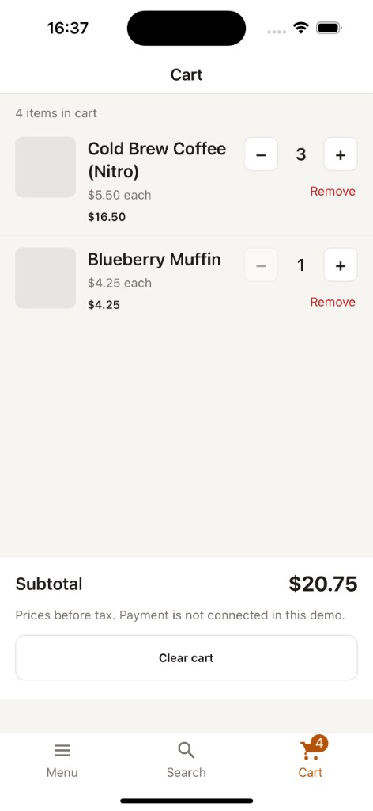

# Per Diem Mobile

React Native (CLI, no Expo) app for browsing multi-location menus powered by the [per-diem-backend](../per-diem-backend) API — a thin proxy over Square sandbox Catalog & Locations.

Architecture follows [AutomatedProdNewsFeed](https://github.com/alikargar1993/AutomatedProdNewsFeed): feature-based folders, Redux Toolkit, React Navigation (tabs + stack), axios API client, AsyncStorage persistence, and shared UI primitives.

## Screenshots

Screenshots from the iOS simulator (iPhone 15 Pro).

| Menu — category filter & availability | Location picker |
| --- | --- |
|  |  |

| Stale menu + pull to refresh | Offline — cached menu & empty state |
| --- | --- |
|  |  |

| Search (location-scoped) | Item detail |
| --- | --- |
|  |  |

| Item detail — cart quantity | Cart |
| --- | --- |
|  |  |

## Features

### Core (take-home requirements)

| Feature | How it works |
|---------|----------------|
| **Location switcher** | Loads locations from `GET /api/locations`, persists selection in AsyncStorage, modal picker on the menu screen |
| **Menu by location** | `GET /api/menu?locationId&at` — items grouped by category in a `SectionList` |
| **Location-scoped catalog** | Only items present at the selected location (handled server-side via Square `present_at_*` / `absent_at_*`) |
| **Category filter** | Horizontal chips from `GET /api/categories`; filter the visible menu sections |
| **Item detail** | Name, description, image, and price formatted from cents (`formatMoney`) via `GET /api/items/:itemId` |
| **Loading / empty / error states** | Skeletons, `ScreenStatePanel`, friendly API error messages — no infinite spinners |

### Bonuses

| Feature | How it works |
|---------|----------------|
| **Time-of-day & day-of-week availability** | Sends device clock as `at` (ISO 8601); backend filters by Square custom attributes. Menu banner shows e.g. `Monday · Lunch` |
| **Search** | Debounced `GET /api/search?locationId&q&at`; scoped to selected location |
| **Cart** | Add from item detail, adjust quantity, remove lines, subtotal; persisted locally in AsyncStorage; tab badge count |
| **Offline-friendly** | Caches locations, categories, and menu per location; offline banner; search disabled offline; stale-data notice with pull-to-refresh; auto-refresh on reconnect |

### Product / UX

- **Bottom tabs** — Menu (stack: list → detail), Search, Cart
- **Light / dark theme** — follows system preference with persisted override (header toggle)
- **Pull-to-refresh** on menu and search
- **Network awareness** — `OfflineBanner`, reconnect handler to refresh stale data

## Tech stack

- **React Native 0.85.3** + TypeScript (strict)
- **React Navigation 7** — bottom tabs + native stack
- **Redux Toolkit** — locations, categories, menu, search, cart
- **axios** — API client with auth headers and normalized errors
- **AsyncStorage** — cart, selected location, offline caches
- **NetInfo** — connectivity detection
- **react-native-svg** — tab icons

## Requirements

- Node.js `>= 22.11.0`
- Yarn
- React Native dev environment ([setup guide](https://reactnative.dev/docs/set-up-your-environment))
- Running [per-diem-backend](../per-diem-backend) on port `3001` (see backend README)

## Installation

```sh
cd PerDiem
yarn install
cp src/shared/config/env.example.ts src/shared/config/env.ts
# Edit src/shared/config/env.ts — set API_GENERAL_TOKEN (see Configuration)
cd ios && bundle install && bundle exec pod install && cd ..
```

## Configuration

**Required before first run.** The app will not authenticate with the backend until you provide local config.

1. Copy the template ( `env.ts` is gitignored and not in the repo):

   ```sh
   cp src/shared/config/env.example.ts src/shared/config/env.ts
   ```

2. Edit `src/shared/config/env.ts`:

   ```ts
   export const API_BASE_URL = 'http://localhost:3001';
   export const API_GENERAL_TOKEN = 'your_api_general_token'; // min 16 chars
   ```

   | Setting | Notes |
   | -------- | ----- |
   | `API_BASE_URL` | Backend URL. Use your machine **LAN IP** on a physical device (not `localhost`). |
   | `API_GENERAL_TOKEN` | Must match `API_GENERAL_TOKEN` in `per-diem-backend/.env`. |
   | Backend CORS | Add your dev origin to `CORS_ORIGINS` on the server if needed. |

3. Restart Metro after changing `env.ts`.

Never commit `env.ts` — it is listed in `.gitignore`. Only `env.example.ts` (empty placeholders) is tracked.

## Run

```sh
yarn start
# separate terminal
yarn ios
# or
yarn android
```

## Tests

```sh
yarn test
CI=true yarn test --watchman=false   # CI / no Watchman
```

## Project structure

```
PerDiem/
├── src/
│   ├── app/                    # App shell, providers, navigation
│   ├── features/
│   │   ├── cart/               # Local cart + persistence
│   │   ├── categories/         # Category filter + cache
│   │   ├── locations/          # Location picker + cache
│   │   ├── menu/               # Menu list, item detail, API client
│   │   └── search/             # Debounced menu search
│   └── shared/
│       ├── api/                # axios client + error types
│       ├── components/ui/      # AppText, AppScreen, AppButton, …
│       ├── config/             # env.example.ts (template); env.ts (local, gitignored)
│       ├── storage/            # AsyncStorage helpers
│       ├── store/              # Redux store + typed hooks
│       ├── theme/              # Colors + ThemeContext
│       └── types/              # Backend DTO mirrors
├── assets/svg/                 # Tab icons
├── docs/screenshots/           # README screenshots
└── __tests__/
```

## Availability

The app sends the device clock as `at` on menu, search, and item requests. The backend filters variations using Square **custom attributes** (sandbox does not expose native Menu schedules — see backend README):

- **`Availability`** — breakfast / lunch / dinner windows in the location timezone
- **`AvailableDays`** — weekday / weekend selections

Unavailable variations are hidden from the menu response, not shown as disabled rows.

## TODO

Features and improvements for a production-ready version:

- **User auth + server cart** — Sync cart to the backend with per-user sessions (JWT/OAuth) instead of device-only AsyncStorage.
- **Modifiers on item detail** — Render Square modifier lists and let guests customize items before adding to cart.
- **Out-of-stock state** — Show inventory from Square when a variation cannot be ordered.
- **Unavailable items UX** — Optionally show out-of-window items as disabled with “Available at breakfast” instead of hiding them entirely.
- **Deeper test coverage** — Redux thunks, `formatMoney`, availability banner, cart totals, and offline fallback paths.
- **Accessibility** — Screen reader labels, larger tap targets audit, and reduced-motion-friendly skeletons.

## Related docs

- Backend setup, API, and trade-offs: [per-diem-backend/README.md](../per-diem-backend/README.md)
- Take-home requirements: [perdiem-fullstack-coding-challenge.txt](../per-diem-backend/perdiem-fullstack-coding-challenge.txt)
